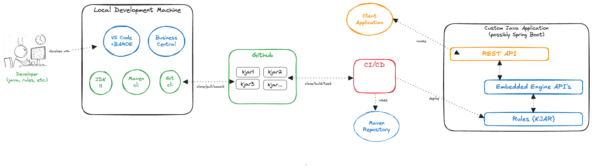

# IBM Business Automation Manager Open Editions - Decision Manager Open Edition v8 - Embedded Engine Sample
This purpose of this repository and its supporting repository modules, is to provide a simple proof of concept of various IBM Business Automation Manager Open Editions (BAMOE) components running in an embedded architecture.

This diagram shows the overall architecture of how BAMOE v8 is typically deployed in an embedded mode:

As you can see from the diagram, rules are authored by the developer or business user using various types of tools, depending upon their role within the organization.  Developers may choose to use the VS Code IDE while other users may use either Excel or possibly the legacy tool known as Business Central _(removed from BAMOE v9 in favor of Canvas)_.  Rule projects are `Maven` projects stored in a `GIT repository`.  From there, your `CI/CD pipeline` can perform standard actions, such as `cloning` your repos, performing a `Maven build` to produce the KJAR.  Your pipeline can also perform `Maven test in order to run unit tests from the pipeline.  Finally, your KJAR is ready to be embedded in your custom application and executed using the Java Engine API, by sending requests to the custom application's external API _(or whatever architecture your custom embedded application is based on)_.

This proof of concept is based on a multi-module GIT repository, which you must clone to your local machine using standard GIT commands:

- [**Maven Setup**](./maven/README.md) - This module contains describes how to setup your local Maven for use with DMOE v8.
- [**DRL Sample KJAR**](./sample-drl-kjar/README.md) - This module contains sample rules, written in Drools Rule Language (DRL), and packaged as a version 8 KJAR.
- [**DMN Sample KJAR**](./sample-dmn-kjar/README.md) - This module contains sample rules, written in Decision Modeling Notation (DMN), and packaged as a version 8 KJAR.
- [**API**](./api/README.md) - This module contains the Java API for invoking a KJAR using the Java embedded engine API's.  Support for both DRL based rules as well as DMN based decision models is provided.
- [**Application**](./application/README.md) - This module contains a custom Java application, that uses JUnit tests to invoke the embedded engine API and execute rules.

## Requirements for Local Machine Setup
The following instructions are helpful in setting up your local environment in order to do BAMOE development.  All functions of BAMOE are available from the developer workstation, including web-based tools and consoles. The following diagram shows the overall architecture:

- **JDK 11** (https://developer.ibm.com/languages/java/semeru-runtimes/downloads/), prefer the IBM Semeru release of JDK, but any OpenJDK will do
- **GIT Command Line Interface** (https://git-scm.com/downloads), plus you are free to install any GIT related extensions or simply use the command line tools
- **Maven Command Line Interface** (https://maven.apache.org/install.html), used for builds and deployments of BAMOE libraries, plus you are free to install any Maven related extensions or simply use command line tools.
- **VS Code IDE** (https://code.visualstudio.com/download), and install the following extensions from the VS Code Marketplace:
`BAMOE Developer Tools`, this is the set of editors for DMN, BPMN, and PMML that developers use to create their visual models in the IDE Drools (by Jim Moody), this is a third-party editor which does simple syntax highlighting of the Drools Rule Language (DRL) files.

> **_NOTE:_**  Since BAMOE v8 is based on an earlier version of the DMN specification, it is important to note that you must install and use the following version of the DMN Extension, as it exists in the VS Code Marketplace....

