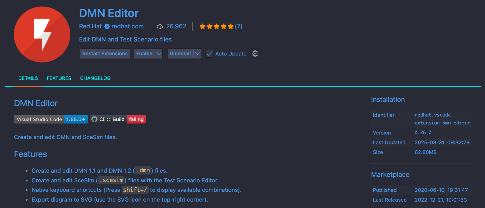

# IBM Business Automation Manager Open Editions - Decision Manager Open Edition v8 - KJAR based on traditional DMN-based Rules
This purpose of this repository module is to provide a sample DMN-based KJAR to be executed using the embedded engine API.

> **_NOTE:_**  Since BAMOE v8 is based on an earlier version of the DMN specification, it is important to note that you must install and use the following version of the DMN Extension, as it exists in the VS Code Marketplace....

